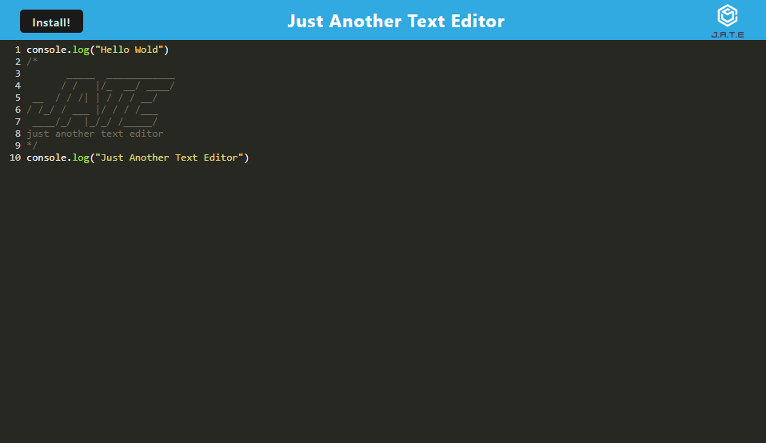

# Text-Editor-PWA

## Description

The motivation behind this project was to build a text editor that can be run in the browser. This application also allows the user to make notes with or without an internet connection and retrieve them later. By developing this application, I could utilize IndexedDB to save the user's notes into a database for storage and then retrieve them so they could be displayed once the user refreshes the application.

## Usage

The user can start that application by running npm run start. Once the user opens the text editor then a database storage is created by IndexedDB. This saves the content that the user inputs into the text editor after clicking off the DOM window. If the user closes and reopens the text editor then they can see their saved content that was retrieved from IndexedDB. The user is also able to download the application to their desktop by clicking on the Install button.

<a href="https://text-editor-pwa-uv8g.onrender.com">Deployed Application</a>

